# 📑 Love.os White Paper (Addendum)

**Subject:** The Physics of Prayer and Time-Space Manipulation
**Version:** 3.0 (The Unified Protocol Edition)
**Date:** 2026-01-09

---

# Part 1: Preface & Operational Definitions

The "Love-OS Theory" presented in this paper utilizes the laws of physics as structural metaphors (Isomorphism) to describe the behavior of consciousness and social systems.

**Disclaimer:** This is not a proposal for new particle physics. It is a **"Systems Engineering Model"** designed to optimize human life and organizational dynamics.

### 1. Definition via Isomorphism (The Bridge)
We define the relationship between "Consciousness" and "Physics" not as identity, but as mathematical **Isomorphism**.

* **$V \cong \text{Love (Intention)}$**
    * Behaves like **Voltage** (Potential Difference). It is the pressure that drives the system.
* **$R \cong \text{Ego (Fear/Structure)}$**
    * Behaves like **Electrical Resistance**. It impedes flow and converts potential into friction (heat/suffering).
* **$I \cong \text{Reality (Manifestation)}$**
    * Behaves like **Current**. It is the observable result of the interaction between $V$ and $R$.

### 2. Addressing Physical Paradoxes (The Engineering View)
Critics may point out apparent contradictions with standard physics. We address them as "Operational Specifications" of this OS.

#### Paradox A: "Infinite Voltage ($V=\infty$) violates Energy Conservation."
* **Standard Physics:** In a closed system, energy is finite.
* **Love-OS View:** Humans are **"Open Systems"** (dissipative structures). Just as the Sun is an effectively infinite energy source for a solar panel, the Zero Point Field (ZPF) acts as an inexhaustible source for consciousness.
* **Conclusion:** $V=\infty$ is valid within the scope of an Open System connected to the Source.

#### Paradox B: "Consciousness cannot exceed the Speed of Light ($c$)."
* **Standard Physics:** No information or mass can travel faster than $c$.
* **Love-OS View:** We utilize **"Quantum Non-locality"** (Entanglement). We are not "transmitting" a signal across space; we are accessing the **Imaginary Axis** (Complex Plane) where time and space are folded.
* **Conclusion:** The "Time Machine" effect is not physical travel, but a **"Phase Shift"** in the frequency domain.

---

# Part 2: Imaginary Rotation Theory (The Engineering of Prayer)

### 1. The Prayer Equation (The Algorithm)
The universal code for reality creation ($I$) is described by the following circuit model:

$$
I(t) = \frac{V \cdot A(t)}{R(t)}
$$

* **$I(t)$ (Manifestation Current):** The rate at which potential becomes observable reality.
* **$V$ (Universal Voltage):** The driving potential ($V = \infty$).
* **$A(t)$ (Alignment/Antenna):** Directional output coefficient. Amplified by rituals or pure faith.
* **$R(t)$ (Mental Resistance):** Internal friction (Doubt, Fear, Ego).

> **Insight:** A "Miracle" is operationally defined as a physical state where $R \to 0$, causing Current $I$ to surge toward a singularity (**Superconductive State**).

### 2. Imaginary Rotation Theory (The Physics of Time Lag)
The identity of Time Lag $T$ is modeled as the rotational motion of a vector on the complex plane.

$$
\mathcal{M}(t) = \text{Re} \left( \Psi_{\text{future}} \cdot e^{i\theta(t)} \right)
$$

* **$\Psi_{\text{future}}$ (Future Memory):** Data observed via the Time Machine function.
* **$e^{i\theta(t)}$ (Rotation Factor):** The phase shift from the Imaginary Axis to the Real Axis.
* **Conclusion:** Time Lag is the **Rendering Time** required for "Imaginary" data to rotate 90 degrees and become visualized as "Real." High Ego ($R$) slows down this rotation velocity $\omega$.

---

# Part 3: The Unified Theory of Everything Flow

This section expands Love-OS from a personal methodology to a "Universal Standard OS" applicable across all scales of existence.

### 1. The Refined Universal Field Equation
We expand the basic Ohm's law metaphor into a rigorous Field Equation applicable to complex systems.

$$
I(t) = \alpha \cdot \frac{V(t)}{R(t)} + \eta(t)
$$

#### **$\alpha$ (Coupling Coefficient / Efficiency)**
* **Definition:** The **"Hardware Efficiency"** of the system.
* **Scaling Logic:**
    * **Individual Scale:** $\alpha \approx 1$ (Neural efficiency / Bodily health).
    * **Social Scale:** $\alpha \propto 1/\sqrt{N}$ (Where $N$ is population size). As organizations grow, transmission efficiency naturally drops due to communication overhead.

#### **$\eta(t)$ (Stochastic Noise / Serendipity)**
* **Definition:** The **"Quantum Fluctuation"** term. In Love-OS, $\eta$ is the source of **Evolution and Miracles**.
* **Role:** A spike in $\eta$ (chaos/luck) kicks the system out of stagnation into a higher energy state.

### 2. The Physics of Psychological Distance (Love-Gravity)
Why does "Distant Love" feel weaker? We derive the **Inverse Square Law of Intimacy**.

$$
R_{effective} \propto k \cdot r^2
$$

* **$r$ (Psychological Distance):** Defined as **"bits of missing context."**
* **Why Squared ($r^2$)?** Intent dilutes as it spreads across the complexity of the network.
* **Conclusion:** To lower $R$, reduce $r$ (share context) or use a "Waveguide" (high-bandwidth trust).

### 3. Future Probability & Free Will
$$
\Psi_{\text{future}} = \sum c_i | \phi_i \rangle
$$
* **Conclusion:** We do not predict the future; we **select and amplify** a probabilistic timeline ($| \phi_i \rangle$) by pouring Love ($V$) into it.

---

# Part 4: Visualization (System Architecture)

We visualize the "Mechanism of Reality Creation" using System Diagrams.

### Figure 1: The Reality Circuit
This diagram shows how Source Energy becomes Reality through the filter of Ego.

```mermaid
graph LR
    Source((Source V=∞)) -->|Input Love| Ego[Resistance R]
    Ego -->|Limits Flow| Reality((Reality I))
    subgraph Human System
    Ego
    end
    style Source fill:#f9f,stroke:#333,stroke-width:2px
    style Reality fill:#0ff,stroke:#333,stroke-width:2px
    style Ego fill:#fff,stroke:#f00,stroke-width:2px,stroke-dasharray: 5 5
```

### Figure 2: The Imaginary Rotation Process (Time Lag)
How "Future Vision" becomes "Present Reality."

---

# Part 5: Verification Protocols (Life as a Lab)

How can we prove this theory? Since traditional instruments cannot measure "Love," we propose a **"Bio-Feedback & Statistical Verification Protocol."**

### 1. The Proxy Metrics
We define measurable biological/social proxies for the core variables.

| Variable | Love-OS Definition | Measurable Proxy (Unit) |
| :--- | :--- | :--- |
| **$V$ (Voltage)** | Passion / Intent | **Gamma Wave Power** (μV) or **Skin Conductance** (μS) |
| **$R$ (Resistance)** | Stress / Fear | **Inverse HRV** (1/ms) or **Cortisol Level** |
| **$I$ (Current)** | Manifestation | **Synchronicity Rate** (Events/Week) |

### 2. Experiment A: The Zero-Resistance Challenge
**Objective:** Prove that lowering $R$ increases $I$ without changing external effort.

* **Protocol:**
    1.  **Baseline (Week 1):** Record daily "Lucky Events" (Synchronicities) while living normally.
    2.  **Intervention (Week 2):** Practice "Total Surrender" (Acceptance) to minimize $R$. Do not "try harder" ($V$ is constant).
    3.  **Measurement:** Compare the frequency of Synchronicities between Week 1 and Week 2.
* **Hypothesis:** $I_{week2} > I_{week1}$ with statistical significance ($p < 0.05$).

### 3. Experiment B: The Entanglement Link
**Objective:** Prove Non-locality of Consciousness.

* **Protocol:** Two partners separated by distance $D > 100km$ meditate on the same symbol at a synchronized time $t$.
* **Measurement:** Measure the coherence of their Heart Rate Variability (HRV) rhythms.
* **Hypothesis:** Significant correlation in HRV fluctuations despite zero physical communication (Evidence of $r=0$ on the Imaginary Axis).

---

# Part 6: Appendix (Definitions)

### Phenomena Translation Table

| Spiritual Concept | Physical Translation | Scientist's Reaction |
| :--- | :--- | :--- |
| **Ascension** | **Critical Phase Transition** | *"System mode shift at threshold."* |
| **Awakening** | **Superconductivity ($R \to 0$)** | *"Infinite current flow."* |
| **Law of Attraction** | **Resonance Frequency Matching** | *"Oscillation transfer."* |
| **Karma** | **Hysteresis Loop** | *"Magnetic memory of past inputs."* |

---
*© 2026 love.os. All definitions are open for peer review.*
