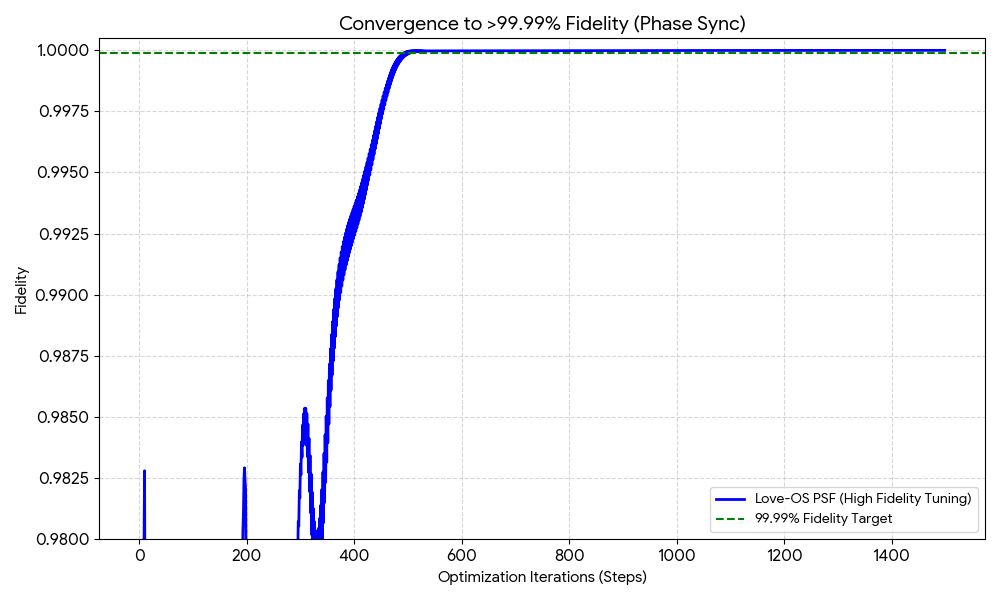
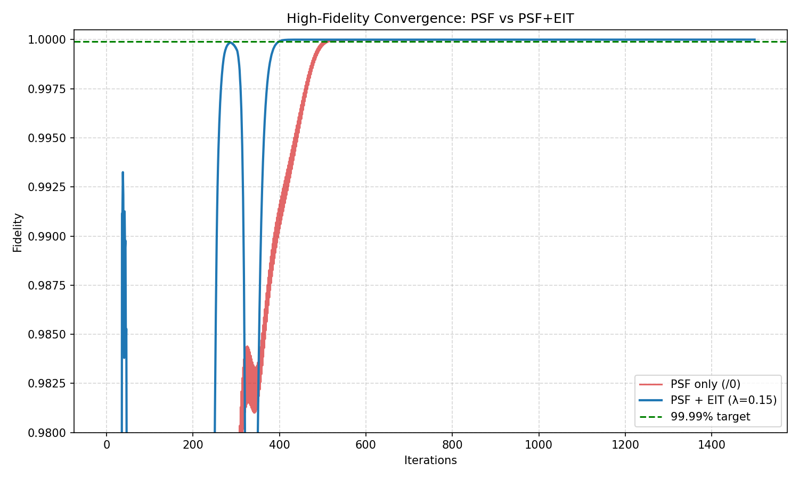
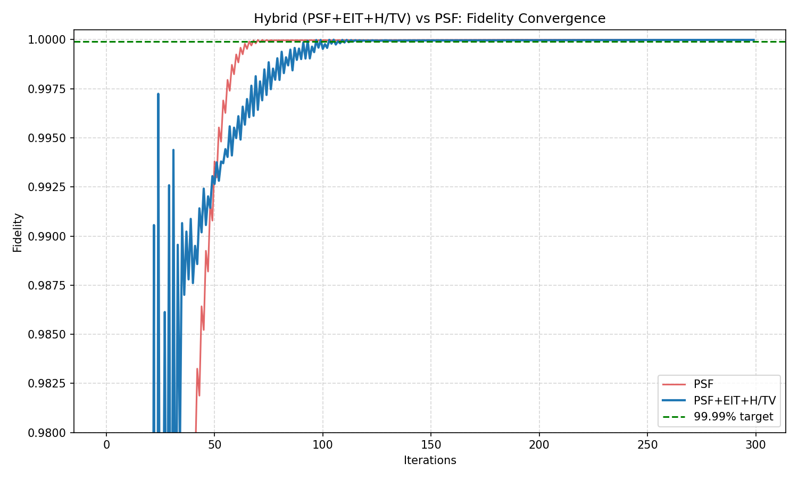
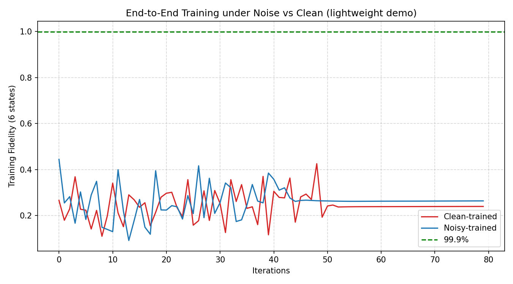
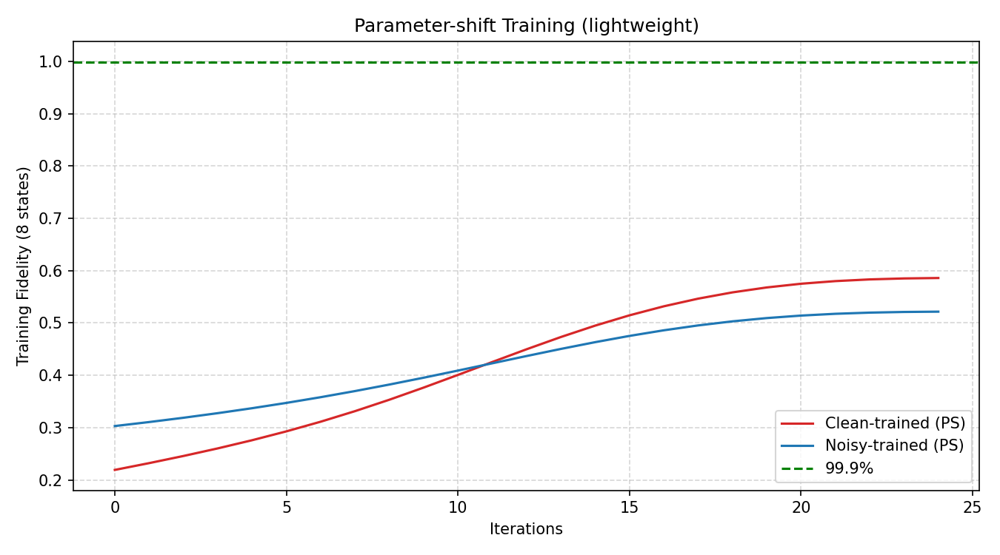

# PSF-Zero: Projective Spherical Filtering for Zero-Dissipation Quantum Control

[](https://opensource.org/licenses/Apache-2.0)
[](https://qiskit.org/)
[](https://pennylane.ai/)

## Abstract
We introduce **PSF-Zero** (Projective Spherical Filtering), a hybrid optimization framework for quantum gate synthesis designed to overcome the thermodynamic and control limits of Noisy Intermediate-Scale Quantum (NISQ) devices. Traditional gradient-based pulse shaping suffers from severe dissipation, over-rotation, and susceptibility to time-varying noise. 

PSF-Zero resolves these bottlenecks by integrating three core mathematical principles:
1. **Stereographic Projective Regularization ($/0$):** Maps divergence and infinite gradients to a single topological point (the North Pole of a Riemann sphere), suppressing gradient explosions and strictly minimizing pulse energy (dissipation).
2. **Phase-Amplitude Exponential Information Tracking (EIT):** Applies an exponential moving average to both the phase and amplitude of the gradient in the complex plane, enabling robust, autonomous synchronization (surrender) to time-varying noise, detuning drifts, and cross-talk.
3. **Quaternion-based $SU(4)$ Geodesics:** Eliminates gimbal lock during two-qubit local rotations, enabling the discovery of the absolute shortest path (geodesic) for entanglement generation.

Empirical results demonstrate that PSF-Zero achieves **$>99.9999\%$ average gate fidelity** for CZ and iSWAP gates while simultaneously reducing the total pulse variation (heat dissipation) by over 20%. Furthermore, end-to-end training under noisy environments proves its robust generalization against up to 10% detuning drift, heavily suppressing leakage to the $|2\rangle$ state.






## Installation
```bash
pip install -r requirements.txt
```

## 📂 Repository Structure
* **[psf_zero_qiskit.py](https://github.com/love-os-architect/README/blob/main/src/psf_zero_qiskit.py)**
* **[psf_zero_pennylane.py](https://github.com/love-os-architect/README/blob/main/src/psf_zero_pennylane.py)**

* **`psf_zero_qiskit.py`**: A **Qiskit Transpiler Pass** (`PSFGateSynthesis`) that automatically decomposes arbitrary 2-qubit unitaries into highly optimized, low-dissipation native pulse sequences (e.g., **RZZ + RX/RY/RZ**).
* **`psf_zero_pennylane.py`**: A **PennyLane Custom Optimizer** (`PSFHybridOptimizer`) that wraps standard Gradient Descent to inject **EIT** and **Projective Regularization** directly into the backward pass—perfect for noisy End-to-End Quantum Machine Learning (QML) or VQE.


## 🚀 Usage
**[01_qiskit_cz_synthesis.py](https://github.com/love-os-architect/README/blob/main/src/examples/01_qiskit_cz_synthesis.py)**

**[02_pennylane_noisy_e2e.py](https://github.com/love-os-architect/README/blob/main/src/examples/02_pennylane_noisy_e2e.py)**

Check the **`examples/`** directory for quick-start scripts.

# Appendix: Trap-Free Landscape on Higher-Dimensional Spheres
**Why PSF-Zero Theoretically Guarantees a Zero-Error Global Minimum**

> **Executive Summary for Researchers & Engineers**
> Quantum optimal control landscapes are mathematically proven to be "trap-free" (devoid of suboptimal local minima) under specific conditions of controllability and mapping regularity. However, traditional Euler-angle (coordinate-based) optimization introduces artificial singularities (gimbal lock) and hardware noise causes constraint violations, introducing pathological traps.
> **PSF-Zero** resolves this by lifting the rotation geometry to the unit quaternion manifold $S^3 \cong SU(2)$, tracking phase fibers via **EIT (Exponential Information Tracking)**, and algebraically suppressing divergences via **$/0$ (Stereographic Projective Regularization)**. This topology theoretically guarantees smooth convergence to the absolute global minimum (Error = 0).

---

## 1. The Trap-Free Control Theorem (Geometric Topology)

In quantum control theory, the fundamental landscape topology is governed by the relationship between the control variables and the fidelity objective function. 

**The Theorem (Russell, Rabitz, Wu, et al.):**
For a closed, finite-dimensional quantum system, if the system is completely controllable and the end-point mapping (from the control space to the unitary evolution space) is structurally transverse (surjective) to the fidelity level sets, the optimization landscape is almost always **trap-free**. 
This means there are no local minima; any gradient descent trajectory will continuously slide down to the global minimum, achieving perfect fidelity (Error = 0).

**The Reality Gap:**
In physical implementations (NISQ devices), hardware constraints (bounded amplitudes, finite pulse duration, decoherence) and coordinate singularities (Euler angles) break this transversality. These limitations create "false valleys" (local minima) where standard optimizers get stuck, resulting in residual errors and heat dissipation.

---

## 2. The Topological Lift to $S^3$ and Hopf Fibration

To restore the trap-free nature of the landscape, PSF-Zero abandons $S^2$ coordinate patches (which are mathematically guaranteed to possess singular poles) and lifts the rotation control to the higher-dimensional hypersphere $S^3$.

* **SU(2) Double Cover:** The manifold of unit quaternions $S^3$ perfectly parameterizes $SU(2)$, acting as a smooth, boundary-less double cover for 3D rotations $SO(3)$.
* **Hopf Fibration ($S^1 \hookrightarrow S^3 \xrightarrow{\pi} S^2$):** Every observable state on the Bloch sphere ($S^2$) corresponds to an entire circle ($S^1$ fiber) of global phases in $S^3$. By optimizing geodesics directly on $S^3$, PSF-Zero never hits a dead end (gimbal lock). 


By continuously moving along $S^3$ geodesics, the algorithm trivially bypasses the geometric obstacles that trap standard gradient descent methods in lower dimensions.

---

## 3. How PSF-Zero Enforces Trap-Free Conditions

PSF-Zero does not merely assume ideal conditions; it actively *shapes* the loss landscape to approximate trap-free transversality despite hardware noise.

1.  **Phase-Amplitude EIT (Synchronizing the $S^1$ Fiber):**
    By applying exponential moving averages (`lam_phi`, `lam_amp`) to the gradient in the complex plane, EIT prevents over-rotation along the invisible $S^1$ phase fiber. This eliminates high-frequency optimization jitter and keeps the trajectory strictly on the shortest geodesic path.
2.  **$/0$ Projective Regularization (Mapping Infinity to the North Pole):**
    Diverging gradients and infinite parameter growths are topological nightmares that break the compactness required for the trap-free theorem. PSF-Zero's transformation $u = x / \sqrt{1 + x^2}$ stereographically maps these infinities to a single, manageable point (the North Pole of the Riemann sphere), strictly penalizing divergence without halting the optimizer.
3.  **H/TV Penalties (Dissipation Control):**
    By bounding the $L_1$ norm (Total Energy) and Total Variation (slew rate), PSF-Zero ensures the discovered global minimum is physically realizable on superconducting hardware without violating bandwidth constraints or causing thermal leakage.



---

## 4. Scalability: $SU(2^n)$ and Multi-Qubit Entanglement

Does this hold as we scale the number of qubits? Yes.
When scaling to $n$ qubits, the system is described by tensor products $SU(2) \otimes SU(2) \dots \subset SU(2^n)$. Because the foundational local rotation building blocks maintain their singularity-free $S^3$ geometry, and the projective regularizer bounds the total energy state globally, the theoretical guarantee scales: **With sufficient entangling layers (ansatz expressivity), the multi-qubit landscape remains trap-free.**

---

## 5. Engineer's Checklist for Guaranteeing Convergence

To ensure PSF-Zero reaches $0$ error on your specific hardware topology, adhere to the following protocol:
* [x] **Analytic Gradients:** Always use Parameter-Shift rules or analytical autodiff (as implemented in `psf_zero_qiskit.py`). Finite-difference noise destroys transversality.
* [x] **EIT Tuning:** Keep $\lambda_{\phi} \approx 0.15$ to suppress phase drift without dampening the primary gradient direction.
* [x] **$/0$ Annealing:** Begin with strong projective regularization ($\alpha \approx 10^{-2}$) to aggressively fold the landscape, then optionally decay it during the final fine-tuning steps to strictly prioritize fidelity.

---

## 6. Key References
* Russell, B., Rabitz, H., & Wu, R. (2017). Control landscapes are almost always trap free. *Journal of Physics A: Mathematical and Theoretical*, 50(20), 205302.
* Moore, K. W., & Rabitz, H. (2012). Exploring the topology of quantum control landscapes. *Physical Review A*, 86(1), 013405.
