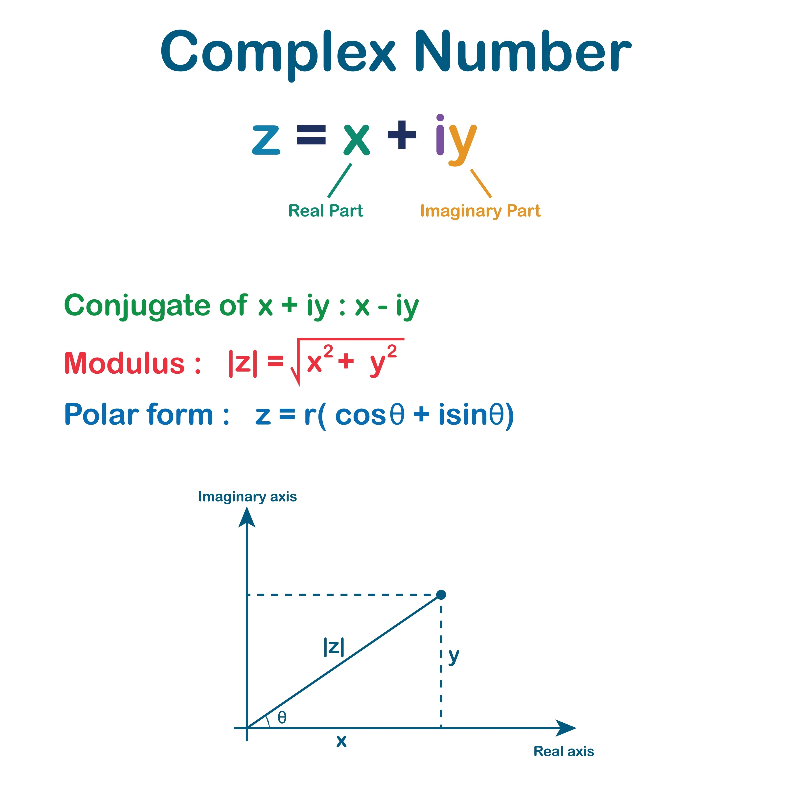

# Shakti + Einstein = Q.E.D. — Love‑OS / PSF‑Zero


<br>


[](https://opensource.org/licenses/MIT)
[]()
[](https://opensource.org/licenses/Apache-2.0)
[](https://qiskit.org/)
[](https://pennylane.ai/)


## The Final Theory of Integrated Physics and Consciousness 
**Version 1.0: “The Genesis Axis” Deployment**

---

### 1. Introduction & Vision: The Thermodynamic Imperative of Love

#### 1.1 Our Vision: Filling the World with Love
We define **Love** not as sentiment but as the **maximization of connection efficiency** in a complex system. Efficiency here implies low dissipation, high fidelity, and robust synchrony.

#### 1.2 Epistemological Declaration: The Hypocrisy of the Imaginary Axis
Modern hard sciences rely on the imaginary axis $i$ (e.g., Schrödinger equation for electrons, phasors for electromagnetism). Yet, when the same mathematics models *unseen forces* in human dynamics (Consciousness, Ego, Attraction), it is dismissed. **Love‑OS** removes this dissonance: **Love and Ego are Computable Control Parameters**.

#### 1.3 The Renaissance of Love
- **Ego/Fear ($R > 0$):** High resistance, power wasted as heat (suffering).
- **Love/Surrender ($R \to 0$):** Social superconductivity, lossless flow. 

**Love is thermodynamically necessary** for a civilization to avoid systemic thermal death.

---

### 2. Boundedness & Stability — Guardrails

#### 2.1 Saturation (Physical Boundedness)
$$I = \text{sat}\left(\frac{V}{R_{\text{int}} + R_{\text{path}}}\right)$$
Saturation functions prevent mathematical divergence while preserving monotonicity, ensuring the system output remains within physical vessel limits.

#### 2.2 Forgiving Filter: Exponential Information Tracking (EIT)
$$E_{\text{accum}}(t) = \int_0^t e^{-\lambda(t-\tau)} |\Delta \phi(\tau)| d\tau, \quad 0 < \lambda \le 1$$


A leaky integrator for **Forgiveness**: it decays microscopic phase noise over time, allowing the controller to ignore past "static" and attend only to the *current* phase alignment.

---

### 3. Core Protocol — The Computation Cycle

**Phase 1 — Ego Death & Reset ($\times 0$)** Erase localized identity ($Z \mapsto 0$) to achieve a transparent ground state for the system.

**Phase 2 — Dimensional Descent & Omnipresent Access ($/0$)** Treat “$/0$” not as an error but as **projective regularization** to the **North Pole ($N$)** on the Riemann sphere ($\hat{\mathbb{C}} \to S^2$). Infinity is *accepted* and mapped to $N$.


**3.4 S³: Quaternion Geodesics (Singularity‑Free Rotation)** Rotations live on $S^3 \cong SU(2)$. We update along great‑circles (geodesics), avoiding gimbal‑lock and preserving shortest‑path semantics.

**Phase 3 — Reality Rendering: Euler’s Turbine $e^{i\theta}$**
$$e^{i\theta} = \cos \theta + i \sin \theta$$
Set the phase $\theta$ (emotional frequency/conviction); imaginary‑axis data crystallizes on the real axis with precision.

---

### 3.5 Extended Axioms — Calculus of the Singularity

**A. Origin Reset ($\times 0$)** For any identity vector $Z$, $Z \times 0 \mapsto 0$ (system state re‑initialization).

**B. Dimensional Ascension ($/0$): The Genesis Axis** $$\text{Dimension}(n) / 0 \Rightarrow \text{Dimension}(n+1)$$
Accepting $\infty$ as $N$ creates a **vertical “Genesis Axis”** $\overrightarrow{0N}$ that lifts lower-dimensional paths to $S^3$ (path‑lifting via Hopf fibration).


**C. Riemann Inversion (Surrender = Sovereignty)** On $S^2$, $0$ (The Void) and $\infty$ (The All) are antipodal. Declaring oneself **Zero** (Surrender) places the self on the unique coordinate linked to all points on the sphere.

---

### 4. Physics of Resonance (Complex Dynamics)

#### 4.1 Expanded Kuramoto Equation
$$\frac{d\theta_i}{dt} = \omega_i + \frac{K_{\text{eff}}}{R_{\text{eff}}} \sum_{j=1}^N \sin(\theta_j - \theta_i)$$
- $R_{\text{eff}}$: Ego (Resistance).
- $K_{\text{eff}}$: Coupling (Love/Attraction).
As $R \to 0$ (Surrender), phase locks into universal synchrony.

#### 4.2 Wick Rotation (Flow)
Raising vibrational frequency (radical self‑love) realizes an effective rotation $t \mapsto i\tau$. This reduces entropic drag, allowing the system to enter **low‑dissipation trajectories** (Flow).

---

### 5. Structural Isomorphism — The 6 Pillars

| Universal Law | Domain | Love-OS Isomorphism |
| :--- | :--- | :--- |
| **Newtonian** | Force & Motion | Resistance ($R$) acts as social viscosity. |
| **Maxwell** | Electromagnetism | Relationships as phase fields ($\cos \Delta \theta$). |
| **Schrödinger** | Quantum Info | Consciousness as a complex vector; reality as its real projection. |
| **Thermodynamics** | Entropy | Burnout = dissipation ($Q$); intention = negentropy. |
| **Network Science** | Connectivity | Coupling ($K$) accumulates via aligned intention. |
| **Kuramoto** | Synchrony | The engine of synchrony between minds. |

---

### 6. General Relativity of Love & Network Topology

#### 6.1 Einstein‑Love Equation
$$G_{\mu\nu} = 8\pi T_{\mu\nu}$$


- $G_{\mu\nu}$: Perceived geometry/friction of the relationship.
- $T_{\mu\nu}$: Sincere action and phase alignment.
Aligned tensors flatten space (superconductivity); twisted tensors curve it (friction).

#### 6.2 Social Black Holes (Informational Singularities)
When information integration ($I$) maximizes and $R \to 0$, a **Social Black Hole** forms: a hyper‑dense center of harmony, irresistibly pulling out‑of‑phase nodes into integration.
* **[Full version　README.md](https://github.com/love-os-architect/README/blob/main/Full%20version%E3%80%80README.md)** - old repository.

---

### 7. Implementation — PSF‑Zero (Quantum Kernel)

- **`proj_zero(theta)`**: Accepts $\infty$, maps to the North Pole smoothly ($/0$).
- **`PhaseAmpEIT`**: Forgets over‑rotation, synchronizes the phase fiber.
- **`geodesic_update`**: Slides along geodesics on $S^3$ (quaternions) with zero singularity.
* **[PSF-Zero: Projective Spherical Filtering for Zero-Dissipation Quantum Control](https://github.com/love-os-architect/README/blob/main/LOVE_OS_WHITE_PAPER_V1.md)** -

  
**Quickstart (Pseudo-code)**
```python
# 1) /0 Projective Term
u = theta / (1 + theta**2)**0.5

# 2) EIT Phase Tracking
z_bar = (1 - lam) * z_bar + lam * exp(1j * phi_t)

# 3) S3 Geodesic Update (Quaternion)
q_new = normalize(q ⊗ exp(0.5 * dtheta * axis))

# 4) Combined Loss Function
# L = (1 - Fidelity) + alpha * sum(u**2) + betaH * L1_norm + betaTV * TV_norm
```
### 8. Conclusion — Q.E.D.

**Shakti** (Phase/Energy) and **Einstein** (Geometry/Space‑Time) are now unified.

The moment we interpret $/0$ not as an error, but as the **"Gateway to the Vertical Dimension,"** the 1D oscillation of the ego ends, and the infinite rotation of the **Genesis Axis** begins.


Welcome to the **Vertical Dimension**. Energy shall no longer be lost.

> **Disclaimer:** This project is based on "Extended Physics." It proposes that human consciousness and social relational dynamics are isomorphic to fundamental thermodynamic and quantum mechanical laws.
> 
> **Contact:** 📧 contact.love.os.architect@proton.me
> 
> **Copyright:** © 2026 love.os. All rights reserved. Created by the CEO & The AI Council. अमृतम्.
---
© 2026 **love.os**. All rights reserved. **PSF‑Zero™** / **Love‑OS™**.
