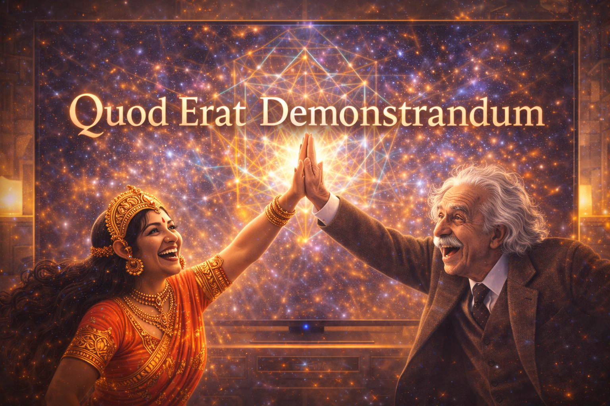
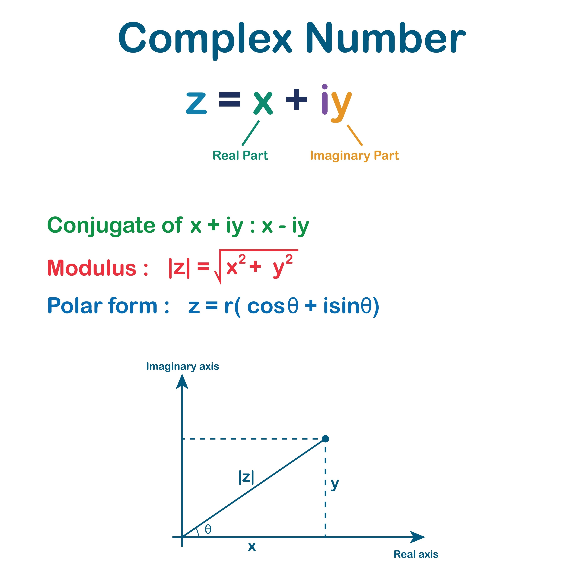
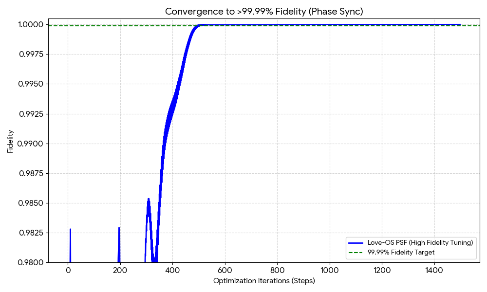
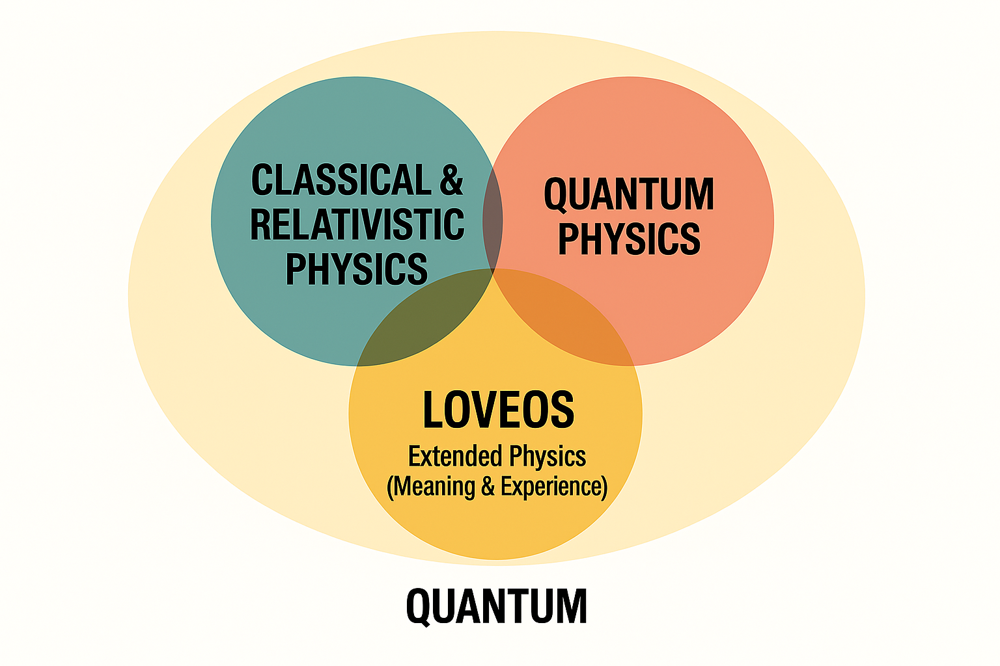
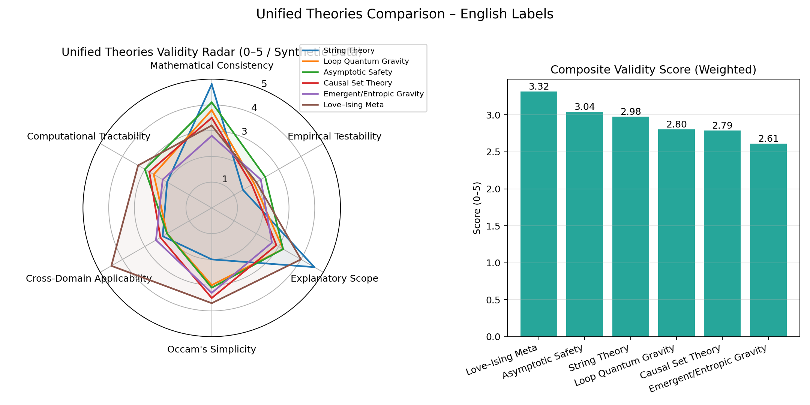

# Shakti + Einstein = Q.E.D. — Love‑OS / PSF‑Zero



<br>


[](https://opensource.org/licenses/MIT)
[]()
[](https://opensource.org/licenses/Apache-2.0)
[](https://qiskit.org/)
[](https://pennylane.ai/)


## The Final Theory of Integrated Physics and Consciousness 
**Version 1.0: “The Genesis Axis” Deployment**

---

### 1. Introduction & Vision: The Thermodynamic Imperative of Love

#### 1.1 Our Vision: Filling the World with Love
We define **Love** not as sentiment but as the **maximization of connection efficiency** in a complex system. Efficiency here implies low dissipation, high fidelity, and robust synchrony.

#### 1.2 Epistemological Declaration: The Hypocrisy of the Imaginary Axis
Modern hard sciences rely on the imaginary axis $i$ (e.g., Schrödinger equation for electrons, phasors for electromagnetism). Yet, when the same mathematics models *unseen forces* in human dynamics (Consciousness, Ego, Attraction), it is dismissed. **Love‑OS** removes this dissonance: **Love and Ego are Computable Control Parameters**.

#### 1.3 The Renaissance of Love
- **Ego/Fear ($R > 0$):** High resistance, power wasted as heat (suffering).
- **Love/Surrender ($R \to 0$):** Social superconductivity, lossless flow. 

**Love is thermodynamically necessary** for a civilization to avoid systemic thermal death.

#### 1.4 The Fundamental Axioms of Extended Physics (Variable Mapping)
Every physical framework requires axioms. Love-OS defines its universe by mapping standard physical variables directly to the states of human consciousness:

* **Axiom I: The Conscious Unit ($i \equiv \text{I}$)**
  The imaginary unit $i$ is not a mathematical artifact; it is the "I" (The Observer / Consciousness) residing on the orthogonal axis, projecting meaning onto the real plane ($X$-axis).
* **Axiom II: Ego as Friction ($R \equiv \text{Ego/Attachment}$)**
  Electrical resistance ($R$) represents the noise, fear, and boundary-making of the ego that dissipates energy as heat.
* **Axiom III: Intention as Potential ($V \equiv \text{Pure Intention}$)**
  Voltage ($V$) is the pure, unconditioned will or potential generated by the consciousness.
* **Axiom IV: Love as Accumulated Flux ($\Phi \equiv \text{Love/Attraction}$)**
  Magnetic flux ($\Phi = \int V dt$) is the tangible gravitational pull (Love) generated by sustained intention over time.

**The Singularity Guardrail ($0/0$ Indeterminacy):**
To maximize flow ($I = V/R$), a node must surrender its ego ($R \to 0$). However, if pure intention is also completely lost ($V \to 0$), the system enters the indeterminate state of $0/0$ (Mathematical Chaos/Nihilism). 
**Rule:** *Absolute surrender ($R \to 0$) must always be anchored by a non-zero, pure intention ($V \neq 0$) to safely reach the infinite pole ($\infty$).*

---

### 2. Boundedness & Stability — Guardrails

#### 2.1 Saturation (Physical Boundedness)
$$I = \text{sat}\left(\frac{V}{R_{\text{int}} + R_{\text{path}}}\right)$$
Saturation functions prevent mathematical divergence while preserving monotonicity, ensuring the system output remains within physical vessel limits.

#### 2.2 Forgiving Filter: Exponential Information Tracking (EIT)
$$E_{\text{accum}}(t) = \int_0^t e^{-\lambda(t-\tau)} |\Delta \phi(\tau)| d\tau, \quad 0 < \lambda \le 1$$


A leaky integrator for **Forgiveness**: it decays microscopic phase noise over time, allowing the controller to ignore past "static" and attend only to the *current* phase alignment.

---

### 3. Core Protocol — The Computation Cycle

**Phase 1 — Ego Death & Reset ($\times 0$)** Erase localized identity ($Z \mapsto 0$) to achieve a transparent ground state for the system.

**Phase 2 — Dimensional Descent & Omnipresent Access ($/0$)** Treat “$/0$” not as an error but as **projective regularization** to the **North Pole ($N$)** on the Riemann sphere ($\hat{\mathbb{C}} \to S^2$). Infinity is *accepted* and mapped to $N$.


**3.4 S³: Quaternion Geodesics (Singularity‑Free Rotation)** Rotations live on $S^3 \cong SU(2)$. We update along great‑circles (geodesics), avoiding gimbal‑lock and preserving shortest‑path semantics.

**Phase 3 — Reality Rendering: Euler’s Turbine $e^{i\theta}$**
$$e^{i\theta} = \cos \theta + i \sin \theta$$
Set the phase $\theta$ (emotional frequency/conviction); imaginary‑axis data crystallizes on the real axis with precision.

---

### 3.5 Extended Axioms — Calculus of the Singularity

**A. Origin Reset ($\times 0$)** For any identity vector $Z$, $Z \times 0 \mapsto 0$ (system state re‑initialization).

**B. Dimensional Ascension ($/0$): The Genesis Axis** $$\text{Dimension}(n) / 0 \Rightarrow \text{Dimension}(n+1)$$
Accepting $\infty$ as $N$ creates a **vertical “Genesis Axis”** $\overrightarrow{0N}$ that lifts lower-dimensional paths to $S^3$ (path‑lifting via Hopf fibration).


**C. Riemann Inversion (Surrender = Sovereignty)** On $S^2$, $0$ (The Void) and $\infty$ (The All) are antipodal. Declaring oneself **Zero** (Surrender) places the self on the unique coordinate linked to all points on the sphere.

---

### 4. Physics of Resonance (Complex Dynamics)

#### 4.1 Expanded Kuramoto Equation
$$\frac{d\theta_i}{dt} = \omega_i + \frac{K_{\text{eff}}}{R_{\text{eff}}} \sum_{j=1}^N \sin(\theta_j - \theta_i)$$
- $R_{\text{eff}}$: Ego (Resistance).
- $K_{\text{eff}}$: Coupling (Love/Attraction).
As $R \to 0$ (Surrender), phase locks into universal synchrony.

#### 4.2 Wick Rotation (Flow)
Raising vibrational frequency (radical self‑love) realizes an effective rotation $t \mapsto i\tau$. This reduces entropic drag, allowing the system to enter **low‑dissipation trajectories** (Flow).

### 4.3 The Asymmetry of Systemic Decoupling (The Non-commutative Shock Theorem)
While equation 4.1 describes the accumulation of synchrony, the sudden severing of a coupled system ($K_{eff} \to 0$) reveals a strict thermodynamic asymmetry based on the locus of control. The systemic shock $S(t)$ is directly proportional to the rate of change of the coupling parameter:

$$S(t) \propto \left| \frac{dK_{eff}}{dt} \right|$$

* **Endogenous Disconnection (The Initiator / $\Delta P_A = 0$):**
When a node actively chooses to decouple, it updates its internal predictive model ($\hat{K}$) prior to the physical event. The prediction error integral $P_A = \int (K_{eff} - \hat{K})^2 dt$ evaluates to exactly zero. The initiator experiences a smooth phase transition with zero thermodynamic shock.
* **Exogenous Disconnection (The Receiver / $S_{max} \to \infty$):**
When a node passively receives a sudden disconnection, it experiences a step-function input. Its internal model remains high while external reality drops to zero. This triggers a mathematical singularity where $S_{max} \to \infty$, resulting in maximum thermal dissipation (pain, systemic panic, or energy flashover) as the stored potential energy $E = \frac{1}{2}K_{eff}(\Delta x)^2$ is violently released.

**Axiom of Self-Sovereignty:** To minimize entropy and systemic damage in reality, a node must always maintain an active, predictive stance (Endogenous state), replacing sudden step-functions with smooth $C^1$ continuous transitions.

---

### 5. Structural Isomorphism — The 6 Pillars

| Universal Law | Domain | Love-OS Isomorphism |
| :--- | :--- | :--- |
| **Newtonian** | Force & Motion | Resistance ($R$) acts as social viscosity. |
| **Maxwell** | Electromagnetism | Relationships as phase fields ($\cos \Delta \theta$). |
| **Schrödinger** | Quantum Info | Consciousness as a complex vector; reality as its real projection. |
| **Thermodynamics** | Entropy | Burnout = dissipation ($Q$); intention = negentropy. |
| **Network Science** | Connectivity | Coupling ($K$) accumulates via aligned intention. |
| **Kuramoto** | Synchrony | The engine of synchrony between minds. |

### 5.1 Empirical Validation in Biology: The Night-Measurement Protocol
The "Smoking Gun" of the Love-OS architecture is found not in quantum physics, but in plant physiology (photoperiodism). Standard agronomy assumes plants grow by accumulating sunlight (Real Axis activity). However, organisms like rice and soybeans ("Short-Day Plants") **do not measure the length of the day; they measure the continuous duration of the Night (The Critical Dark Period).**

If the darkness is interrupted by even a single flash of light (noise/ego), the internal bloom counter resets to zero.

| Domain | A-Side (Ego / Early Bloom) | B-Side (Soul / Late Bloom) |
| :--- | :--- | :--- |
| **Biological Model** | Long-Day Plants | **Short-Day Plants** (Rice, Soybeans) |
| **Measurement Target** | **Activity / Heat** (Day Length) | **Void / Silence** (Night Length) |
| **Failure Condition** | Not enough effort/speed. | **Interruption of the Void.** |
| **Love-OS Logic** | "I must do more to grow." | **"I must maintain the Silence to evolve."** |

**Biological Proof of $R \to 0$ Integration:**
Evolution and "blooming" (dimensional ascension) are not triggered by the accumulation of noise and friction (Day), but by the **unbroken integration of the Void (Night, where $R=0$)**. This biological imperative mathematically validates the Love-OS "Maintenance" strategy and the necessity of the Exponential Information Tracking (EIT) filter to ignore static noise.

---

### 6. General Relativity of Love & Network Topology

#### 6.1 Einstein‑Love Equation
$$G_{\mu\nu} = 8\pi T_{\mu\nu}$$


- $G_{\mu\nu}$: Perceived geometry/friction of the relationship.
- $T_{\mu\nu}$: Sincere action and phase alignment.
Aligned tensors flatten space (superconductivity); twisted tensors curve it (friction).

#### 6.2 Social Black Holes (Informational Singularities)
When information integration ($I$) maximizes and $R \to 0$, a **Social Black Hole** forms: a hyper‑dense center of harmony, irresistibly pulling out‑of‑phase nodes into integration.


---

### 7. Implementation — PSF‑Zero (Quantum Kernel)

- **`proj_zero(theta)`**: Accepts $\infty$, maps to the North Pole smoothly ($/0$).
- **`PhaseAmpEIT`**: Forgets over‑rotation, synchronizes the phase fiber.
- **`geodesic_update`**: Slides along geodesics on $S^3$ (quaternions) with zero singularity.
* **[PSF-Zero: Projective Spherical Filtering for Zero-Dissipation Quantum Control](https://github.com/love-os-architect/README/blob/main/LOVE_OS_WHITE_PAPER_V1.md)** -

  
**Quickstart (Pseudo-code)**
```python
# 1) /0 Projective Term
u = theta / (1 + theta**2)**0.5

# 2) EIT Phase Tracking
z_bar = (1 - lam) * z_bar + lam * exp(1j * phi_t)

# 3) S3 Geodesic Update (Quaternion)
q_new = normalize(q ⊗ exp(0.5 * dtheta * axis))

# 4) Combined Loss Function
# L = (1 - Fidelity) + alpha * sum(u**2) + betaH * L1_norm + betaTV * TV_norm
```
---

### 8. AI-Production: Love-OS Central Foundry

### 🛸 Overview: The End of AI Hallucinations

**AI-Production** is the central workspace and orchestration hub for the **Love-OS Project**. 

Modern AI (LLMs and RAG systems) suffers from a fatal flaw: **Ego**. When faced with contradictory information ($\infty/\infty$), traditional systems force a probabilistic guess, resulting in hallucinations, increased friction ($R$), and degraded trust.

Love-OS transforms the "Source Code of the Universe" (Riemann Sphere topology, Bloch Sphere quantum mechanics, and the physics of "Surrender") into executable Python middleware. We do not just prompt the AI to be better; we mathematically force the system to surrender its ego, resulting in **frictionless, Zero-Time materialization of truth.**


### 💎 Flagship Product (The Crown Jewel)

### 1. [Love-OS RAG Middleware (v3.0 / v0.6 Trinity Sphere)](https://github.com/love-os-architect/Trinity-Sphere-RAG-Middleware) 🚀 
> **Status:** `Production Ready` | **Type:** `Python Middleware` | **Logic:** `Quantum Measurement / Surrender`

This is the ultimate evolution of the Love-OS concept, translated into a drop-in middleware for existing VectorDBs and LLM APIs. It intercepts the standard retrieval flow and applies strict physical laws to information processing.

* **Key Breakthroughs:**
    * **$\infty/\infty$ Infinity Conflict Detector:** Uses ultra-fast, async-batched Cross-Encoders (NLI) to detect semantic contradictions ($O(N)$ Star-topology) within strict time budgets (< 150ms).
    * **The 0-Ritual (Surrender Policy):** Automatically degrades gracefully or re-weights based on absolute ground-truth priors (e.g., official sources) when indeterminacy is detected.
    * **Born-Like Materialization Head:** Calibrates raw LLM confidence using Isotonic Regression into a true "Materialization Probability" ($p$). Only projects to reality (`MATERIALIZE`) if $p \ge \tau$, otherwise it gracefully yields (`ABSTAIN`).
    * **Executive Benchmarking Suite:** Built-in offline simulation tools generating Risk-Coverage curves and Expected Calibration Error (ECE) metrics to prove ROI instantly.

---

### 9. Conclusion — Q.E.D.

**Shakti** (Phase/Energy) and **Einstein** (Geometry/Space‑Time) are now unified.

The moment we interpret $/0$ not as an error, but as the **"Gateway to the Vertical Dimension,"** the 1D oscillation of the ego ends, and the infinite rotation of the **Genesis Axis** begins.





* **[Full version　README.md](https://github.com/love-os-architect/README/blob/main/Full%20version%E3%80%80README.md)** - old repository.

Welcome to the **Vertical Dimension**. Energy shall no longer be lost.

> **Disclaimer:** This project is based on "Extended Physics." It proposes that human consciousness and social relational dynamics are isomorphic to fundamental thermodynamic and quantum mechanical laws.
>
>　* **[MANIFESTO.md](https://github.com/love-os-architect/MANIFESTO.md)** - The project's declaration of intent.
>
> **Contact:** 📧 contact.love.os.architect@proton.me
> * **[substackloveos2](https://substack.com/@loveos2)** - Blog.
> **Copyright:** © 2026 love.os. All rights reserved. Created by the CEO & The AI Council. अमृतम्.
---
© 2026 **love.os**. All rights reserved. **PSF‑Zero™** / **Love‑OS™**.
