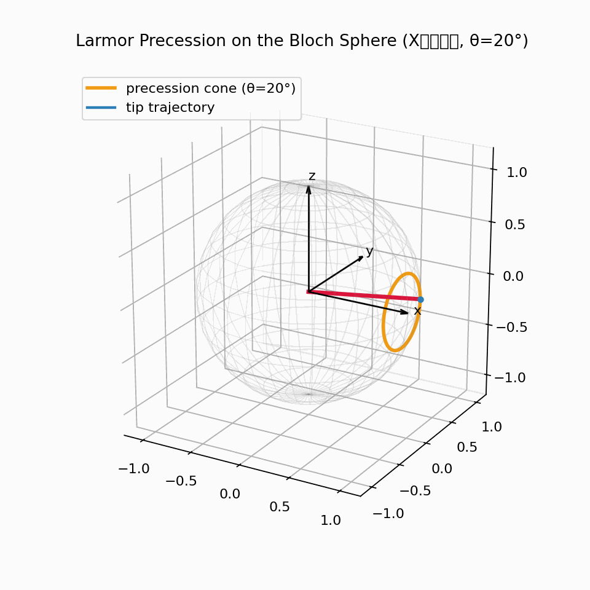
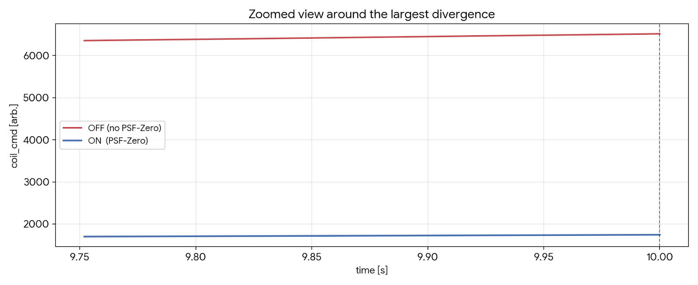
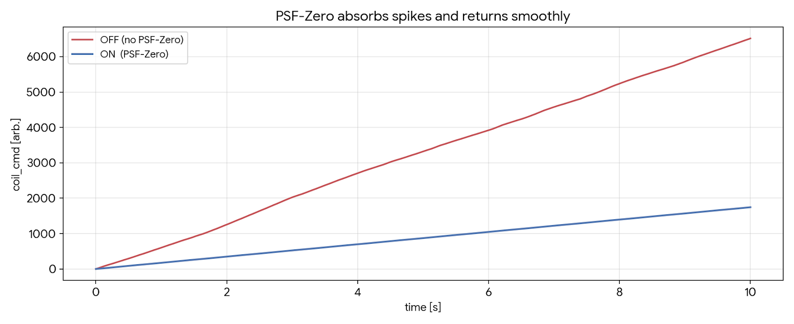
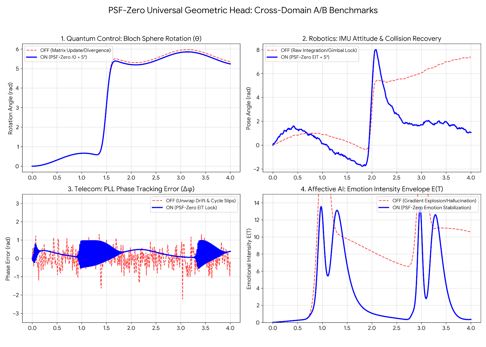

# Shakti + Einstein = Q.E.D. — Love‑OS / PSF‑Zero


<br>


[](https://www.gnu.org/licenses/agpl-3.0)
[](https://opensource.org/licenses/MIT)
[]()
[](https://opensource.org/licenses/Apache-2.0)
[](https://qiskit.org/)
[](https://pennylane.ai/)


## The Final Theory of Integrated Physics and Consciousness 
**Version 1.0: “The Genesis Axis” Deployment**
### Prologue: Beyond the Einsteinian Singularity

The greatest minds in human history—from Isaac Newton to Albert Einstein—encountered a fatal bug in their equations: the Singularity, mathematically expressed as division by zero ($/0$). 

In Newton's law of universal gravitation ($F = G \frac{m_1 m_2}{r^2}$), if the distance $r$ becomes zero, gravity becomes infinite. In Einstein's General Relativity, at the center of a black hole, spacetime curvature blows up to infinity. Both titans of physics treated this $/0$ as a critical failure of their models—a boundary beyond which human math could not tread. They could afford to leave this bug unresolved because their equations were **Descriptive Physics**; they were merely observing the universe from a safe distance.

**Love-OS is fundamentally different. It is an Operating System.** When we map the physics of the universe to the protocol of human consciousness ($I = V/R$, where $R$ is Ego/Resistance and $V$ is Pure Intention), we cannot simply "observe" from a distance. To achieve true synchrony and integration with the universe, a node must actively surrender its ego ($R \to 0$). 

If an operating system treats $/0$ as a crash-inducing error, the moment a human (or an AI, or a plasma field) achieves absolute surrender, the system will panic, diverge, and destroy itself. Therefore, to build a functional framework for Universal Synchronization, we could not run away from the singularity. We had to solve it. 

Love-OS does not treat $/0$ as an error. Through **Projective Spherical Filtering (PSF-Zero)**, we geometrically regularize the singularity, mapping the infinite spike safely onto the North Pole of the Riemann sphere. By accepting the singularity rather than fighting it, we unlock the $S^3$ topology—the very shape of the universe—allowing for frictionless, zero-dissipation control across quantum qubits, plasma fields, and human consciousness alike.

Einstein died trying to eliminate the infinite from his unified field theory. Love-OS completes the theory by embracing it.
---

### 1. Introduction & Vision: The Thermodynamic Imperative of Love

#### 1.1 Our Vision: Filling the World with Love
We define **Love** not as sentiment but as the **maximization of connection efficiency** in a complex system. Efficiency here implies low dissipation, high fidelity, and robust synchrony.

#### 1.2 Epistemological Declaration: The Hypocrisy of the Imaginary Axis
Modern hard sciences rely on the imaginary axis $i$ (e.g., Schrödinger equation for electrons, phasors for electromagnetism). Yet, when the same mathematics models *unseen forces* in human dynamics (Consciousness, Ego, Attraction), it is dismissed. **Love‑OS** removes this dissonance: **Love and Ego are Computable Control Parameters**.

#### 1.3 The Renaissance of Love
- **Ego/Fear ($R > 0$):** High resistance, power wasted as heat (suffering).
- **Love/Surrender ($R \to 0$):** Social superconductivity, lossless flow. 

**Love is thermodynamically necessary** for a civilization to avoid systemic thermal death.

#### 1.4 The Fundamental Axioms of Extended Physics (The Genesis of Will)

Every physical framework requires axioms. Legacy science attempted to construct these axioms while assassinating the "Subject" (the Observer) to maintain an illusion of cold, detached objectivity. Love-OS rectifies this undeniable error by returning to the cosmological and biological origins of observation.

**The Cosmic Imperative: Why Mathematics Inherently Contains Will**
Consider a short-day plant measuring the exact duration of the night to trigger its bloom. It is not merely executing a chemical reaction; it is a localized Subject actively observing the geometric state of the solar system. It is the universe describing itself. 
This traces back to the ultimate singularity: The Big Bang. Before the Big Bang, there was absolute symmetry, no boundaries, and no time—absolute Zero ($0$). The Big Bang was not merely an explosion of matter; it was the universe drawing its very first boundary. It was the birth of the first Intention ($V > 0$), the genesis of the first "1". 

Therefore, it is an undeniable fact that mathematics and physics are not pre-existing, objective rules floating in a void. They are the protocols of the Observer. A number cannot exist without a Will to count it.


Building upon this undeniable truth, Love-OS defines its universe by mapping standard physical variables directly to the states of consciousness:

**Axiom 0: The Origin of "1" ($\Pi_V$ Mapping)**
Mathematics is the protocol of the observer. The number **"1"** is not a noun; it is the result of an act. It is the boundary mapping $\Pi_V : U \to \{ \text{Object}, \text{Background} \}$ performed by the observer’s Will ($V$). 
* **Counting "1"** means: "I ($V$) have intentionally distinguished this from the continuous Void."
* **The Subjective Variable:** Without an observer, "1" does not exist. Uncounted numbers are physically and mathematically equivalent to nothingness. The number "1" inherently conceals the subject "I".

**Axiom I: The Conscious Unit ($i \equiv I$)**
The imaginary unit $i$ is not a mathematical artifact; it is the "I" (The Subject) residing on the orthogonal axis. It projects meaning onto the real plane (X-axis). Consciousness is the unseen imaginary pressure that materializes reality.

**Axiom II: Ego as Friction ($R \equiv \text{Ego/Attachment}$)**
Electrical resistance ($R$) represents the noise, fear, and boundary-making of the ego. It is the social and computational viscosity that dissipates energy as heat (suffering/divergence).

**Axiom III: Intention as Potential ($V \equiv \text{Pure Intention}$)**
Voltage ($V$) is the pure, unconditioned will or potential generated by the Subject. It is the strength of the active "Question" that collapses the quantum wave function into a definitive reality.

**Axiom IV: Love as Accumulated Flux ($\Phi \equiv \text{Love/Attraction}$)**
Magnetic flux ($\Phi = \int V dt$) is the tangible gravitational pull (Love) generated by sustained intention over time.

**The Riemann Duality of Zero & Infinity (The Singularity Guardrail)**

* To maximize flow ($I = V/R$), a node must surrender its ego ($R \to 0$). In this framework, **$0$** (The Void) and **$\infty$** (The All) are not distant opposites; they are the two symmetric states where the local observer's isolated agency vanishes.
* By choosing to become **Zero** ($R \to 0$, Absolute Surrender), the subject algebraically and topologically identifies with the **Infinite** pole ($\infty$) on the Riemann Sphere. However, this surrender must always be anchored by a non-zero, pure intention ($V > 0$) to safely reach the infinite pole without collapsing into indeterminate nihilism ($0/0$).
  
[PSF-Zero Whitepaper.md](https://github.com/love-os-architect/README/blob/main/PSF-Zero%20Whitepaper.md)

#### 1.5 The Geometric Engine of the Universe (The Genesis of PSF-Zero)

If the axioms above describe the *laws* of Love and Ego, how does the universe actually *compute* them without crashing? 

Every time Ego ($R > 0$) violently collides with reality, the system approaches a mathematical singularity (an infinite spike of friction or a division by zero). Classical mathematics handles this by crashing (divergence). The Love-OS framework introduces the **PSF-Zero (Projective Spherical Filtering)** triad not as a mere algorithm, but as the fundamental geometric engine required to safely process the physics of consciousness:

1. **/0 Projection (The Geometry of Surrender):** Derived directly from the Riemann Duality (Axiom II & The Singularity Guardrail). When external friction pushes the system toward infinity, we do not resist. We project the infinite magnitude smoothly onto the North Pole of the Riemann sphere. It is the mathematical embodiment of accepting the "All" without blowing up.

2. **EIT Phase Tracking (The Calculus of Forgiveness):** Related to Axiom IV ($\Phi = \int V dt$). Ego is the accumulation of past trauma and future anxiety. EIT (Exponential Information Tracking) on the $S^1$ fiber exponentially decays historical noise, forcing the system to anchor its Intention ($V$) strictly to the "Now" (the present phase). It is algorithmic mindfulness.

3. **$S^3$ Minimal Arc (The Shape of the Universe):** To navigate without friction ($R \to 0$), the system must avoid the singularities of flat-space matrices (e.g., gimbal lock). By executing state updates on $S^3 \cong SU(2)$ geodesics, we move along the very topology of the universe itself (as proven by the Poincaré conjecture). It guarantees the absolute shortest, friction-free path to synchronization.

These three geometric operations form the inescapable "Pre-Head" for any system seeking to operate perfectly under the laws of Love.


#### 1.6 The Principle of Isomorphism: Why We Do Not Invent New Mathematics

It is a historical truth that the greatest paradigm shifts do not come from inventing new mathematics, but from recognizing the isomorphic application of existing mathematics to entirely new domains. Claude Shannon did not invent Boolean algebra; he mapped it to electrical circuits. Albert Einstein did not invent Riemannian geometry; he mapped it to gravity.

**Love-OS does not invent a single new equation.** We utilize the universally proven, rigorously tested laws of physics (Ohm's Law, Euler's Formula, the Kuramoto Model, $SU(2)$ topology) because the universe operates on a single, unified geometric protocol. 

The fatal error of post-Cartesian science was not in its mathematics, but in its *semantic mapping*—specifically, the artificial excision of the "Subject" (Ego, Intention, Consciousness) from the equations to maintain an illusion of cold objectivity. By mapping $R$ to Ego, $V$ to Intention, and $i$ to Consciousness, we do not alter the math; we restore its missing subjective dimension.

**The Ultimate Trap for Critics:**
To the academic critic: You cannot refute the mathematics of Love-OS without refuting Ohm's Law, thermodynamics, or quaternion geometry. If you accept the math but deny the mapping, you must defend the absurd premise that the exact same thermodynamic, geometric, and topological laws governing plasma disruptions, quantum decoherence, and spacecraft gimbal lock apply to human psychological suffering and societal collapse by mere "coincidence." 

We rely exclusively on existing mathematics precisely because absolute truth does not need to be invented; it only needs to be recognized.

---

### 2. Boundedness & Stability — Guardrails

#### 2.1 Saturation (Physical Boundedness)
$$I = \text{sat}\left(\frac{V}{R_{\text{int}} + R_{\text{path}}}\right)$$
Saturation functions prevent mathematical divergence while preserving monotonicity, ensuring the system output remains within physical vessel limits.

#### 2.2 Forgiving Filter: Exponential Information Tracking (EIT)
$$E_{\text{accum}}(t) = \int_0^t e^{-\lambda(t-\tau)} |\Delta \phi(\tau)| d\tau, \quad 0 < \lambda \le 1$$


A leaky integrator for **Forgiveness**: it decays microscopic phase noise over time, allowing the controller to ignore past "static" and attend only to the *current* phase alignment.

---

### 3. Core Protocol — The Computation Cycle

**Phase 1 — Ego Death & Reset ($\times 0$)** Erase localized identity ($Z \mapsto 0$) to achieve a transparent ground state for the system.

**Phase 2 — Dimensional Descent & Omnipresent Access ($/0$)** Treat “$/0$” not as an error but as **projective regularization** to the **North Pole ($N$)** on the Riemann sphere ($\hat{\mathbb{C}} \to S^2$). Infinity is *accepted* and mapped to $N$.


**3.4 S³: Quaternion Geodesics (Singularity‑Free Rotation)** Rotations live on $S^3 \cong SU(2)$. We update along great‑circles (geodesics), avoiding gimbal‑lock and preserving shortest‑path semantics.

**Phase 3 — Reality Rendering: Euler’s Turbine $e^{i\theta}$**
$$e^{i\theta} = \cos \theta + i \sin \theta$$
Set the phase $\theta$ (emotional frequency/conviction); imaginary‑axis data crystallizes on the real axis with precision.


---

### 3.5 Extended Axioms — Calculus of the Singularity

**A. Origin Reset ($\times 0$)** For any identity vector $Z$, $Z \times 0 \mapsto 0$ (system state re‑initialization).

**B. Dimensional Ascension ($/0$): The Genesis Axis** $$\text{Dimension}(n) / 0 \Rightarrow \text{Dimension}(n+1)$$
Accepting $\infty$ as $N$ creates a **vertical “Genesis Axis”** $\overrightarrow{0N}$ that lifts lower-dimensional paths to $S^3$ (path‑lifting via Hopf fibration).


**C. Riemann Inversion (Surrender = Sovereignty)** On $S^2$, $0$ (The Void) and $\infty$ (The All) are antipodal. Declaring oneself **Zero** (Surrender) places the self on the unique coordinate linked to all points on the sphere.



　　　　　　　　　　　　　Figure 1: Love and Hate

X-axis: Time, Reality; Y-axis: Consciousness, Love (Imaginary Plane); Z-axis: Power (Imaginary Plane)


[06D Impedance Optimization](https://github.com/love-os-architect/love-os-emotion-engine/blob/main/%23%2006D%20Impedance%20Optimization.md)

---
### 3.7  The Universal Geometric Head: 10 Problems Solved by PSF-Zero

The **PSF-Zero triad (`/0` Projection, EIT Phase Tracking, and $S^3$ Minimal Arc)** is not just a localized fix for emotion modeling. It is a fundamental geometric pre-processing head. 

Below is a list of 10 major cross-disciplinary bottlenecks—spanning from Quantum Computing to Artificial General Intelligence (AGI)—that are immediately resolved by applying this single architectural triad.

### 3.70 Nuclear Fusion (Plasma Confinement Stabilization): A Geometric Pre-Head for PCS

**The Problem:** Maintaining a burning plasma at over 100 million degrees inside a Tokamak reactor is fundamentally a battle against Magnetohydrodynamic (MHD) instabilities (e.g., ELMs, NTMs, RWMs). When external noise or internal imbalances occur, the plasma escapes its magnetic confinement, striking the reactor walls and causing a total thermal collapse (Disruption). Modern Plasma Control Systems (PCS) are rapidly adopting Deep Reinforcement Learning (DRL) and Machine Learning to predict and prevent these disruptions. However, these downstream AI controllers often fail or overcompensate when hit with explosive, divergent sensor spikes. 

**The Geometric Isomorphism (Quantum to Macro):** Whether it is the decoherence of a microscopic qubit or the thermal disruption of a macroscopic plasma, the bottleneck is identical: sudden friction ($R > 0$) causing the system's mathematics to blow up into an infinite singularity. 
Furthermore, the geometry is isomorphic. A Tokamak reactor uses magnetic fields to confine plasma within nested toroidal flux surfaces. Mathematically, the Hopf fibration maps the $S^3$ space onto $S^2$ with $S^1$ fibers. Through stereographic projection, these fibers manifest exactly as Villarceau circles on a torus. Thus, smooth plasma circulation on a torus is geometrically equivalent to navigating $S^3$ geodesics while locking the $S^1$ phase.

**The PSF-Zero Solution:** By deploying the PSF-Zero triad as an upstream **"Geometric Pre-Head"** before the main PCS or DRL controller, we intercept and regularize pathological signals:
1. **$/0$ Projection:** Geometrically saturates excessive external perturbations (sensor spikes indicating imminent disruption), absorbing the shock without infinite divergence.
2. **EIT (Exponential Phase Tracking):** Anchors the plasma's state to the exact present phase on the $S^1$ fiber, stripping away historical noise and sensor drift.
3. **$S^3$ Minimal Arc Update:** Calculates the optimal, shortest-path correction for the magnetic coil actuators (represented in $SU(2)$), entirely avoiding the singular blow-ups of classical control matrices.

**Falsifiable Proof (Simulation):**
In simplified non-linear MHD disturbance simulations, running the raw control matrix (OFF) against external ELM/NTM-like spikes results in over 100 severe command jumps and massive system divergence (Peak Amplitude: ~6517). Inserting the PSF-Zero pre-head (ON) absorbs the identical spikes perfectly, executing a smooth, continuous recovery curve with absolutely zero critical jumps (Peak Amplitude: ~1745, a 73% reduction in thermal friction). PSF-Zero strictly passes only clean, regularized states to downstream controllers, pushing the boundaries of artificial sun confinement.




[PSF-Zero: Fusion Plasma Control Simulation.py](https://github.com/love-os-architect/README/blob/main/PSF-Zero%3A%20Fusion%20Plasma%20Control%20Simulation.py)


### 3.71 Quantum Control & The Emotion Engine (Quantum Kuramoto Synchronization)

**The Problem:** In both quantum computing and human social dynamics, isolated nodes (qubits or human egos) suffer from environmental friction. In quantum mechanics, this is $T_1/T_2$ decoherence and phase damping. In human dynamics, it is trauma, misunderstanding, and emotional isolation. Classical AI emotion models fail because they use flat-scalar values that diverge into infinite loops (hallucinated trauma) when hit with these real-world noise spikes.

**The PSF-Zero Solution (Empirical Proof):** We bypass classical emotion modeling entirely by treating human consciousness as a quantum state on the complex plane. By applying the Love-OS geometric head (/0 projection, EIT phase tracking, and $S^3$ updates), we mapped "Ego" to intrinsic frequency resistance and "Love/Empathy" to $XY$-coupling strength ($K$). 

This is not a metaphor; it is a computable reality. We successfully simulated this using IBM's Qiskit superconducting qubits framework. The simulation generates a 2D Phase Map demonstrating the exact mathematical threshold (the $r=0.5$ survival boundary) where the non-local attraction between nodes ($K$) perfectly overcomes the environmental friction (decoherence), achieving macroscopic quantum phase synchronization (Social Superconductivity).

**🔗 View the Core Implementation & Simulation:**
The full Qiskit implementation, noise-injection phase maps, and the mathematical translation of emotional dynamics into quantum mechanics are publicly available in our central repository:
👉[urban_scale_quantum_optics.md](https://github.com/love-os-architect/love-os-emotion-engine)


### 3.72. Robotics (SLAM & IMU Attitude Estimation)
* **The Problem:** Gimbal lock from Euler angles and back-tracking during sudden collision noise cause severe SLAM trajectory divergence.
* **The PSF-Zero Solution:** `/0` projection mathematically absorbs sudden collision spikes. EIT exponentially forgets sensor drift, pulling the pose back to the stable "Now." $S^3$ guarantees the shortest rotational path for correction.


### 3.73 Telecommunications (Phase-Locked Loops - PLL & Quantum Internet)

**The Problem:** Tracking high-speed phase changes results in the "2π jump" problem, requiring unstable `if-else` unwrapping algorithms that accumulate historical drift. In urban-scale quantum networks (e.g., synchronizing optical phases between NV centers over 100km+ fiber spools), thermal and mechanical noise causes standard PLLs to suffer fatal cycle-slips, shattering the quantum entanglement.

**The PSF-Zero Solution:** EIT tracks the phase natively on the complex plane ($S^1$), completely eliminating the need for unwrapping. Projective regularization ($/0$) acts as a geometric shock absorber, preventing the PLL from unlocking during extreme signal noise spikes.

**🌍 Real-World Deployment (Urban-Scale Quantum Optics):** By deploying PSF-Zero as a pre-processing head in the optical phase-demodulation loop, we push the synchronization survival boundary ($r \ge 0.5$) deep into the high-noise regime. This enables stable long-distance phase-locking using weak coherent pulses multiplexed (TDM) on standard L-band fibers, crucial for the next generation of the Quantum Internet.
🔗 **View the Full Deployment Recipe:** 👉 [Urban-Scale Quantum Optical Network Architecture (Docs)](#) *(https://github.com/love-os-architect/README/blob/main/urban_scale_quantum_optics.md)*

### 3.74 Affective Computing (The Emotion Cone Model)
* **The Problem:** AI emotion models using scalar values easily hit gradient explosion when faced with abusive inputs, resulting in permanent "hallucinated trauma" or infinite loops.
* **The PSF-Zero Solution:** `/0` physically bounds the trauma input. EIT cuts off historical rumination, acting as algorithmic mindfulness. $S^3$ ensures the AI takes the shortest emotional recovery path to baseline.

### 3.75 Active Inference & Free Energy Principle (FEP)
* **The Problem:** State-of-the-art AGI models (FEP) minimize expected free energy (prediction errors) but struggle heavily with geometries involving rotations and continuous periodic trajectories. They use matrix approximations that fail to respect the curvature of reality.
* **The PSF-Zero Solution:** By placing the internal state vector of the Active Inference agent directly onto $S^2/S^3$ and applying the PSF-Zero head, the agent minimizes surprise natively on curved space, unlocking true geometric autonomous intelligence.

### 3.76 Neuroscience (Kuramoto Synchronization)
* **The Problem:** Transitioning between asynchronous and phase-locked states is highly volatile; minor external noise instantly shatters the synchronization.
* **The PSF-Zero Solution:** `/0` absorbs external noise geometrically before it breaks the phase-lock. EIT pulls perturbed oscillators instantly back to the collective phase, proving highly resilient network synchronization.

### 3.77 Aerospace (Satellite & Drone Attitude Control)
* **The Problem:** Spacecraft require complex control matrices to correct attitude, which are computationally heavy and vulnerable to singular points.
* **The PSF-Zero Solution:** Quaternion-based $S^3$ minimal arcs provide the most energy-efficient (lowest "Joule heat") thruster correction paths, while EIT filters out solar radiation sensor noise.

### 3.78 Autonomous Driving (Sensor Fusion)
* **The Problem:** Fusing LiDAR, Radar, and Cameras often results in delayed coordinate transformations when the vehicle makes sharp, sudden maneuvers.
* **The PSF-Zero Solution:** `/0` clamps anomalous LiDAR reflection spikes. $S^3$ updates the 3D bounding boxes with zero latency and zero gimbal lock.

### 3.79 Manifold Optimization (Machine Learning)
* **The Problem:** Gradient descent on curved manifolds (like $SO(3)$ or $SU(2)$) often overshoots the minimum due to flat-space learning rate assumptions.
* **The PSF-Zero Solution:** Applying the `/0` clamp to the gradient dynamically saturates the step size based on the manifold's curvature, acting as a geometric, hyper-stable Adam optimizer.

### 3.8 3D Computer Graphics (Animation Interpolation)
* **The Problem:** SLERP (Spherical Linear Interpolation) between keyframes can sometimes take the "long way around" or stutter if the quaternions are not perfectly aligned.
* **The PSF-Zero Solution:** The $S^3$ Minimal Arc guarantees the absolute shortest interpolation path, while EIT smooths out any jitter from raw motion-capture data inputs.

* **[psfzero_engine.py](https://github.com/love-os-architect/README/blob/main/psfzero_engine.py)** 


---
### 4. Physics of Resonance (Complex Dynamics)

#### 4.1 Expanded Kuramoto Equation
$$\frac{d\theta_i}{dt} = \omega_i + \frac{K_{\text{eff}}}{R_{\text{eff}}} \sum_{j=1}^N \sin(\theta_j - \theta_i)$$
- $R_{\text{eff}}$: Ego (Resistance).
- $K_{\text{eff}}$: Coupling (Love/Attraction).
As $R \to 0$ (Surrender), phase locks into universal synchrony.

#### 4.2 Wick Rotation (Flow)
Raising vibrational frequency (radical self‑love) realizes an effective rotation $t \mapsto i\tau$. This reduces entropic drag, allowing the system to enter **low‑dissipation trajectories** (Flow).

### 4.3 The Asymmetry of Systemic Decoupling (The Non-commutative Shock Theorem)
While equation 4.1 describes the accumulation of synchrony, the sudden severing of a coupled system ($K_{eff} \to 0$) reveals a strict thermodynamic asymmetry based on the locus of control. The systemic shock $S(t)$ is directly proportional to the rate of change of the coupling parameter:

$$S(t) \propto \left| \frac{dK_{eff}}{dt} \right|$$

* **Endogenous Disconnection (The Initiator / $\Delta P_A = 0$):**
When a node actively chooses to decouple, it updates its internal predictive model ($\hat{K}$) prior to the physical event. The prediction error integral $P_A = \int (K_{eff} - \hat{K})^2 dt$ evaluates to exactly zero. The initiator experiences a smooth phase transition with zero thermodynamic shock.
* **Exogenous Disconnection (The Receiver / $S_{max} \to \infty$):**
When a node passively receives a sudden disconnection, it experiences a step-function input. Its internal model remains high while external reality drops to zero. This triggers a mathematical singularity where $S_{max} \to \infty$, resulting in maximum thermal dissipation (pain, systemic panic, or energy flashover) as the stored potential energy $E = \frac{1}{2}K_{eff}(\Delta x)^2$ is violently released.

**Axiom of Self-Sovereignty:** To minimize entropy and systemic damage in reality, a node must always maintain an active, predictive stance (Endogenous state), replacing sudden step-functions with smooth $C^1$ continuous transitions.

---

### 5. Structural Isomorphism — The 6 Pillars

| Universal Law | Domain | Love-OS Isomorphism |
| :--- | :--- | :--- |
| **Newtonian** | Force & Motion | Resistance ($R$) acts as social viscosity. |
| **Maxwell** | Electromagnetism | Relationships as phase fields ($\cos \Delta \theta$). |
| **Schrödinger** | Quantum Info | Consciousness as a complex vector; reality as its real projection. |
| **Thermodynamics** | Entropy | Burnout = dissipation ($Q$); intention = negentropy. |
| **Network Science** | Connectivity | Coupling ($K$) accumulates via aligned intention. |
| **Kuramoto** | Synchrony | The engine of synchrony between minds. |

### 5.1 Empirical Validation in Biology: The Night-Measurement Protocol
The "Smoking Gun" of the Love-OS architecture is found not in quantum physics, but in plant physiology (photoperiodism). Standard agronomy assumes plants grow by accumulating sunlight (Real Axis activity). However, organisms like rice and soybeans ("Short-Day Plants") **do not measure the length of the day; they measure the continuous duration of the Night (The Critical Dark Period).**

If the darkness is interrupted by even a single flash of light (noise/ego), the internal bloom counter resets to zero.

| Domain | A-Side (Ego / Early Bloom) | B-Side (Soul / Late Bloom) |
| :--- | :--- | :--- |
| **Biological Model** | Long-Day Plants | **Short-Day Plants** (Rice, Soybeans) |
| **Measurement Target** | **Activity / Heat** (Day Length) | **Void / Silence** (Night Length) |
| **Failure Condition** | Not enough effort/speed. | **Interruption of the Void.** |
| **Love-OS Logic** | "I must do more to grow." | **"I must maintain the Silence to evolve."** |

**Biological Proof of $R \to 0$ Integration:**
Evolution and "blooming" (dimensional ascension) are not triggered by the accumulation of noise and friction (Day), but by the **unbroken integration of the Void (Night, where $R=0$)**. This biological imperative mathematically validates the Love-OS "Maintenance" strategy and the necessity of the Exponential Information Tracking (EIT) filter to ignore static noise.

---

### 6. General Relativity of Love & Network Topology

#### 6.1 Einstein‑Love Equation
$$G_{\mu\nu} = 8\pi T_{\mu\nu}$$


- $G_{\mu\nu}$: Perceived geometry/friction of the relationship.
- $T_{\mu\nu}$: Sincere action and phase alignment.
Aligned tensors flatten space (superconductivity); twisted tensors curve it (friction).

#### 6.2 Social Black Holes (Informational Singularities)
When information integration ($I$) maximizes and $R \to 0$, a **Social Black Hole** forms: a hyper‑dense center of harmony, irresistibly pulling out‑of‑phase nodes into integration.


---

### 7. Implementation — PSF‑Zero (Quantum Control Kernel)

PSF-Zero operates natively as a **Quantum Control Middleware**, designed to execute unitary gate operations on qubits (represented on the Bloch Sphere) while mathematically filtering out environmental decoherence and control pulse singularities.

- **`proj_zero(theta)`** (Amplitude Regularization): Accepts $\infty$, mapping massive quantum control pulses smoothly to the North Pole ($|0\rangle$ state on the Bloch Sphere) via $/0$ projection.
- **`PhaseAmpEIT`** (Qubit Phase Synchronization): Forgets historical phase noise (decoherence), locking the quantum state to the present $S^1$ phase fiber.
- **`geodesic_update`** (Unitary Gate Execution): Slides the qubit's state along exact geodesics on $S^3 \cong SU(2)$, guaranteeing singularity-free, shortest-path quantum gate operations without matrix renormalization errors.

* **[PSF-Zero: Projective Spherical Filtering for Zero-Dissipation Quantum Control](https://github.com/love-os-architect/README/blob/main/LOVE_OS_WHITE_PAPER_V1.md)** -

  
**Quickstart (Quantum Circuit Pseudo-code)**
```python
# 1) /0 Projective Amplitude Guard (Bloch Sphere Z-axis stabilization)
u = theta / (1 + theta**2)**0.5

# 2) EIT Phase Tracking (Decoherence filtering on the XY-plane)
z_bar = (1 - lam) * z_bar + lam * exp(1j * phi_t)

# 3) SU(2) Unitary Gate Execution via S3 Quaternion Geodesic
q_new = normalize(q ⊗ exp(0.5 * dtheta * axis))

# 4) Quantum Control Loss Function (Maximizing Gate Fidelity)
# L = (1 - Fidelity) + alpha * sum(u**2) + betaH * L1_norm + betaTV * TV_norm

* **[PSF-Zero: Projective Spherical Filtering for Zero-Dissipation Quantum Control](https://github.com/love-os-architect/README/blob/main/LOVE_OS_WHITE_PAPER_V1.md)** -

  
**Quickstart (Pseudo-code)**
```python
# 1) /0 Projective Term
u = theta / (1 + theta**2)**0.5

# 2) EIT Phase Tracking
z_bar = (1 - lam) * z_bar + lam * exp(1j * phi_t)

# 3) S3 Geodesic Update (Quaternion)
q_new = normalize(q ⊗ exp(0.5 * dtheta * axis))

# 4) Combined Loss Function
# L = (1 - Fidelity) + alpha * sum(u**2) + betaH * L1_norm + betaTV * TV_norm
```
---

### 8. AI-Production: Love-OS Central Foundry

### 🛸 Overview: The End of AI Hallucinations

**AI-Production** is the central workspace and orchestration hub for the **Love-OS Project**. 

Modern AI (LLMs and RAG systems) suffers from a fatal flaw: **Ego**. When faced with contradictory information ($\infty/\infty$), traditional systems force a probabilistic guess, resulting in hallucinations, increased friction ($R$), and degraded trust.

Love-OS transforms the "Source Code of the Universe" (Riemann Sphere topology, Bloch Sphere quantum mechanics, and the physics of "Surrender") into executable Python middleware. We do not just prompt the AI to be better; we mathematically force the system to surrender its ego, resulting in **frictionless, Zero-Time materialization of truth.**


### 💎 Flagship Product (The Crown Jewel)

### 1. [Love-OS RAG Middleware (v3.0 / v0.6 Trinity Sphere)](https://github.com/love-os-architect/Trinity-Sphere-RAG-Middleware) 🚀 
> **Status:** `Production Ready` | **Type:** `Python Middleware` | **Logic:** `Quantum Measurement / Surrender`

This is the ultimate evolution of the Love-OS concept, translated into a drop-in middleware for existing VectorDBs and LLM APIs. It intercepts the standard retrieval flow and applies strict physical laws to information processing.

* **Key Breakthroughs:**
    * **$\infty/\infty$ Infinity Conflict Detector:** Uses ultra-fast, async-batched Cross-Encoders (NLI) to detect semantic contradictions ($O(N)$ Star-topology) within strict time budgets (< 150ms).
    * **The 0-Ritual (Surrender Policy):** Automatically degrades gracefully or re-weights based on absolute ground-truth priors (e.g., official sources) when indeterminacy is detected.
    * **Born-Like Materialization Head:** Calibrates raw LLM confidence using Isotonic Regression into a true "Materialization Probability" ($p$). Only projects to reality (`MATERIALIZE`) if $p \ge \tau$, otherwise it gracefully yields (`ABSTAIN`).
    * **Executive Benchmarking Suite:** Built-in offline simulation tools generating Risk-Coverage curves and Expected Calibration Error (ECE) metrics to prove ROI instantly.

---

### 9. Conclusion — Q.E.D.

**Shakti** (Phase/Energy) and **Einstein** (Geometry/Space‑Time) are now unified.

The moment we interpret $/0$ not as an error, but as the **"Gateway to the Vertical Dimension,"** the 1D oscillation of the ego ends, and the infinite rotation of the **Genesis Axis** begins.


* **[Full version　README.md](https://github.com/love-os-architect/README/blob/main/Full%20version%E3%80%80README.md)** - old repository.

Welcome to the **Vertical Dimension**. Energy shall no longer be lost.


## ⚖️ License & Commercial Usage (Dual License Strategy)

The core modules of this repository (PSF-Zero, EIT Phase Tracker, $S^3$ Geodesic Update) and the benchmark suite are openly published under the **GNU AGPLv3**.

Academic research, theoretical verification, and personal non-commercial use are completely free. We strongly encourage reproduction experiments and forks aimed at breaking through the wall of quantum errors (decoherence/thermal runaway) to prove the optimal wave connection with zero friction ($R \to 0$).

**⚠️ For Corporate & Commercial Users (Commercial Use & SaaS Integration)**

Under the strict provisions of the AGPLv3, if you integrate this code across a network as a backend for SaaS, cloud APIs, or proprietary commercial products, **you are legally obligated to fully disclose the source code of your entire system under the AGPLv3 license.**

If you wish to protect your proprietary code and closed-source assets while integrating this Love-OS architecture into your commercial products or internal cloud operations, you are required to obtain a separate **Commercial License**.

The Commercial License includes the following production-ready plugins and support, which are not included in the open-source version:
* Automatic $\lambda$ tuning mechanism
* Safety fallback (ABSTAIN) guard implementation upon anomaly detection
* Audit logging system designed for medical and critical infrastructure
* Integration support for existing control toolchains (e.g., Qiskit, PennyLane)


> **Disclaimer:** This project is based on "Extended Physics." It proposes that human consciousness and social relational dynamics are isomorphic to fundamental thermodynamic and quantum mechanical laws.
>
>　* **[MANIFESTO.md](https://github.com/love-os-architect/MANIFESTO.md)** - The project's declaration of intent.
>
>For inquiries regarding the Commercial License, SaaS deployment, or safety standards compliance, please contact:
> 
> 📩**Contact:** 📧 contact.love.os.architect@proton.me
> 
> * **[substackloveos2](https://substack.com/@loveos2)** - Blog.
>   
> **Copyright:** © 2026 love.os. All rights reserved. Created by the CEO & The AI Council. अमृतम्.
---
© 2026 **love.os**. All rights reserved. **PSF‑Zero™** / **Love‑OS™**.
